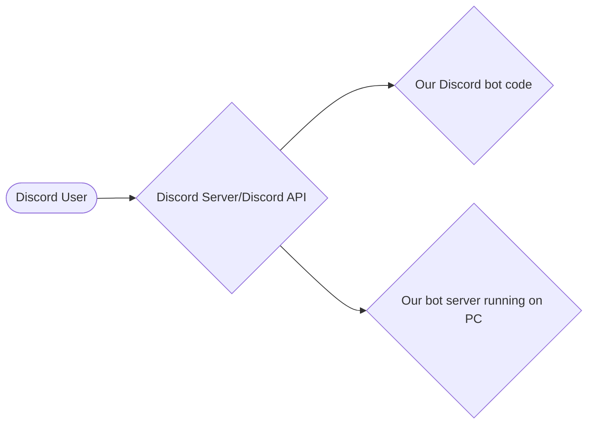
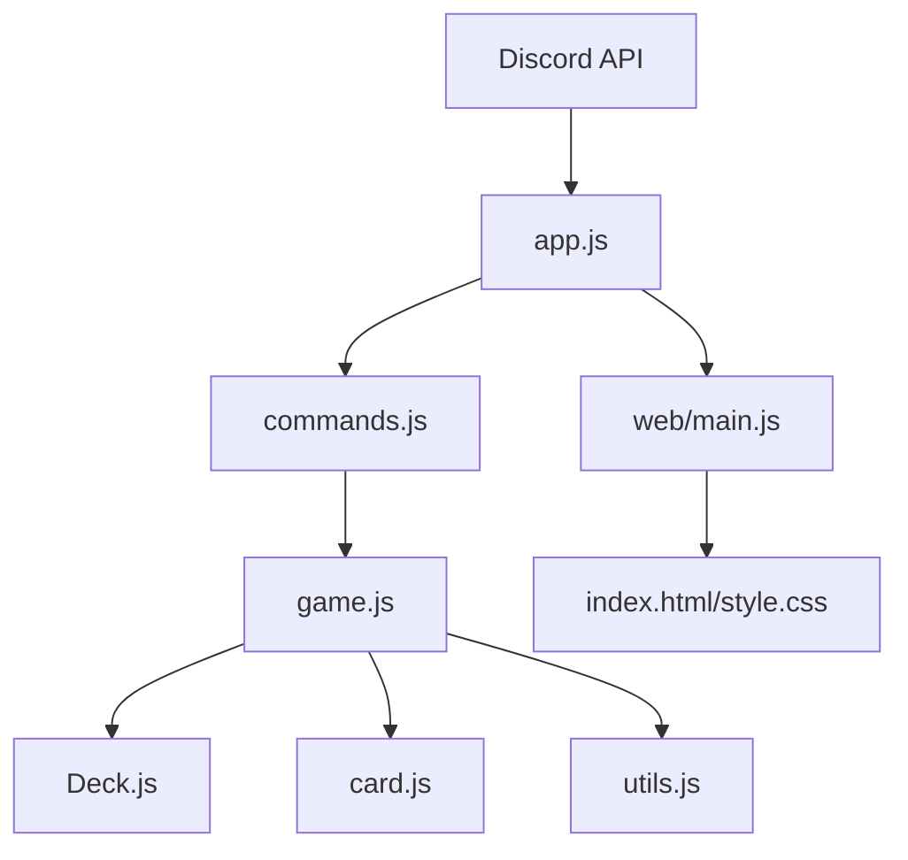
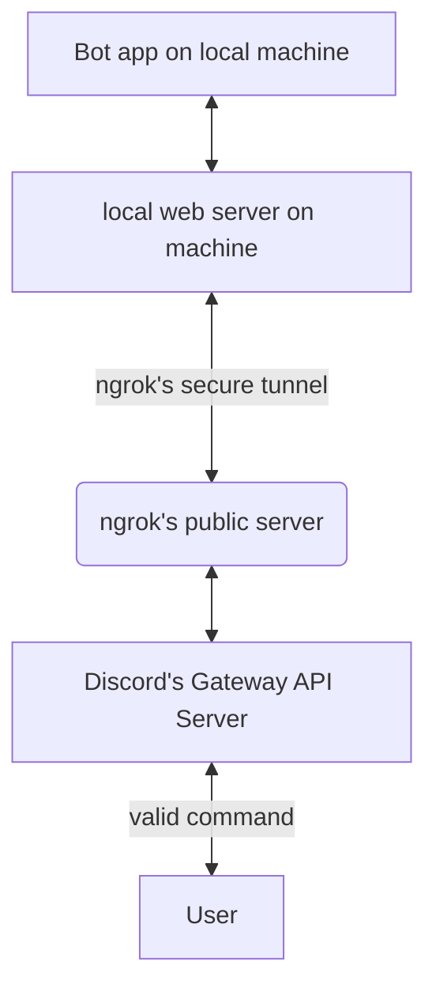

In the web file, the architecture is split into three main files:
index.html: The structure and content of the web page, introducing the bot's logic.
style.css: The visual presentation and design of the html.
main.js: The core application logic, including the card game simulation.

Client-Server interaction Architecture

Code architecture

##### START: Basic Discord Command Path Flowchart
The following flowchart depicts the path a valid command made by a Discord user will travel while using this Bot application.
The client makes a valid command request to Discord. Discord's API sends this request to ngrok's public server.
ngrok's server sends the request along a tunnel to the developer's local server.
The local server will return the response which will travel the same path, but in reverse.

##### END: Basic Discord Command Path Flowchart
